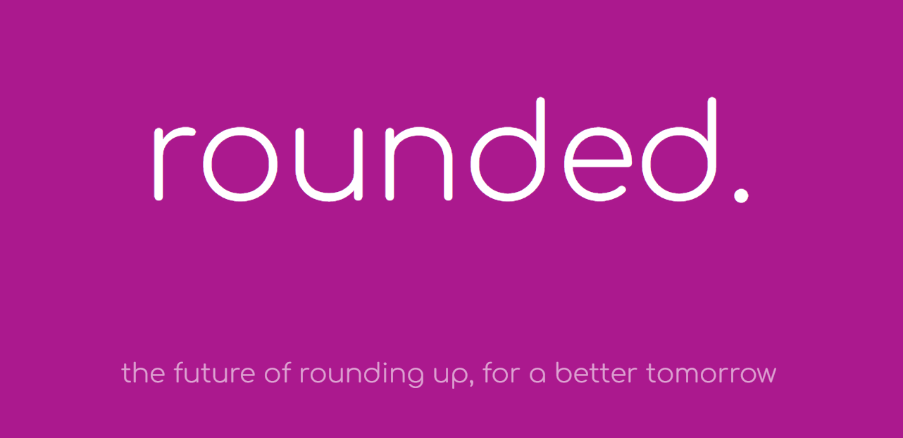

  

  <h1 align="center">rounded.</h1>

---

## Inspiration
Have you ever gone shopping, and after your big order, you were asked if you wanted to round up for charity? No matter how much you were buying, it was always a mere fraction of what you were paying, and it looked quite nice on your credit card bill. It's so easy for individuals, who wouldn't normally be donating, to take these pennies from their account and send it towards some real good, but we found that there was no real analog for this in the digital realm. As our day-to-day lives begin to move online, shouldn't our goodwill as well?

## What it does
Rounded is a Web3 platform linked to the DeSo blockchain and your finances. First, rounded uses banking APIs like Plaid and PayPal to connect to your online money platforms, and tracks your transaction history. Every time a new transaction is made (i.e. your PayPal balance changes), rounded will ask you if you'd like to round up. When you say yes, it will submit an order with the rounded price and a foundation of your choosing to our backend, which will take $DESO from your wallet and move it into the foundations' wallet. You will then be returned with a TransactionHex as a receipt for your order.

## How we built it
Our frontend was built from the ground up with NextJS and React, creating a comprehensive user interface that held all banking information client-side. This meant that sensitive user data was only being stored clientside, allowing our backend to handle pure order requests. The backend was built on Django and used the DRF (djangorestframework) to create a REST API to handle all requests and talk to the Postgre database. When making transactions on the $DESO blockchain, the backend uses the BitClout V1 DeSo API to generate and sign transactions.

## Challenges we ran into
Unfortunately, $DESO coin is still in Beta, and strong documentation is extremely scarce. We had great lengths of difficulty figuring out how to generate, authenticate, sign, and submit these transactions directly to the blockchain through DeSo's relatively new API, and since none of us had significant experience with controlling crypto wallets with code, it proved a pretty tough feat.

## Accomplishments that we're proud of
We're really happy with how the demo website came out, and eventually, we were able to overcome our issues with trading $DESO, and were able to generate unsigned transactions for demonstration purposes. This project was the culmination of a lot of quick thinking, documentation reading, and learning, and we're all proud of what we were able to take away from it.

## What we learned
Most profoundly was the structure of the $DESO blockchain. We learned about how to create, authenticate, and sign crypto trades on the blockchain, and about the BIP-39 mnemonic spec for generating secure wallets. Along with that, we learned a lot about JWT's and privileged API requests, whether it was to our own API or external ones. (nextjs does not like external API requests)

## What's next for rounded
Philanthropy is always going to be a global issue, and rounded is paving the path for it to move online.

The next steps for rounded would look like the development of a mobile dashboard along with SMS push notifications every time a transaction is made, asking users if they'd be willing to round up. Along with that, the creation of a browser extension to detect if users are on certain base URLs and when they are making a purchase, ask if they'd like to simultaneously make a donation. We may also open the platform to creators, who, when being paid online, can register with rounded to receive tips through our platform.

Web3 is the future, we're here to make sure that **everyone** is along for the ride.

- rounded
